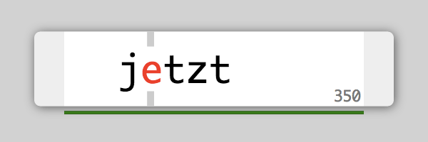

# jetzt

*jetzt* is a speed-reader extension for [chrome](http://google.com/chrome) inspired by [Spritz](http://www.spritzinc.com/).

### Screenshot

Here's what jetzt looks like in your browser:

### Installation

This is very much beta software so a proper chrome extension package is not currently provided. Instead: clone this repository, then, in chrome, navigate to chrome://extensions , enable developer mode, click "Load unpacked extension..." and select the directory you cloned.

Remember to pull every now and then for bugfixes and new features.

### Usage

Control is currently keyboard-only.

- Initiate jetzt by pressing `alt`-`s` and clicking on the block of text you wish to read. Alternatively, select some text before pressing `alt`-`s`.

- Change size with `+`/`-`.

- Go faster/slower with up/down arrow keys.

- Go back/forward a sentence with left/right arrow keys (hold `alt` to navigate by paragraphs).

- Pause with space.

- Close with escape.

- Switch between light/dark themes with `0`

- Toggle statistics message with `/` or `?`

### Online Demo

[Here](http://ds300.github.com/jetzt/)

### Bookmarklet

You can also use it as a bookmarklet by:
- Copying the content of bookmarklet.js
- Manually adding a new bookmark
- Pasting the content into the location field.

### ToDo

Check out the [ToDo](https://github.com/ds300/jetzt/wiki/ToDo) section of the wiki.

### Feature Requests/Contributions

Feel free to open an issue for anything you would like to see in jetzt, but have a quick look through the closed issues first to make sure it is not a duplicate request.

I also welcome pull requests of all shapes and sizes. Please submit to the dev branch, or to master if it is only a small bugfix. If it is your first time contributing to jetzt, please add your name to the list below.

### Contributors

- [Gustav Ahlberg](https://github.com/Gyran)
- [Peter Uithoven](https://github.com/peteruithoven)
- [h0ru5](https://github.com/h0ru5)
- [Noah Slater](http://github.com/nslater
- [fusillicode](https://github.com/fusillicode)
- [Brian Hanson](https://github.com/brianjhanson)
- [ianzapolsky](https://github.com/ianzapolsky)
- [Martin Butt](https://github.com/martinkiva)

### License

     Copyright 2014 David Sheldrick and contributors

     Licensed under the Apache License, Version 2.0 (the "License");
     you may not use this file except in compliance with the License.
     You may obtain a copy of the License at

         http://www.apache.org/licenses/LICENSE-2.0

     Unless required by applicable law or agreed to in writing, software
     distributed under the License is distributed on an "AS IS" BASIS,
     WITHOUT WARRANTIES OR CONDITIONS OF ANY KIND, either express or implied.
     See the License for the specific language governing permissions and
     limitations under the License.
   

### | (• ◡•)| (❍ᴥ❍ʋ)
